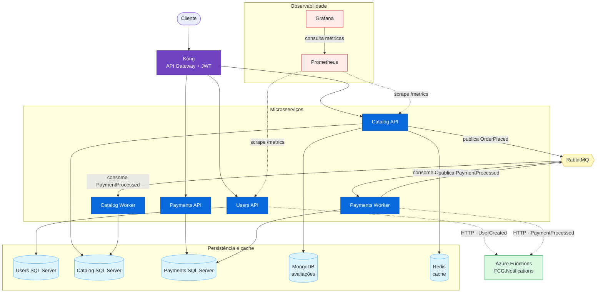

# FCG.Orchestration

Infraestrutura local e manifests Kubernetes da solução FIAP Cloud Games.

O repositório orquestra Users, Catalog e Payments, seus workers e dependências. A FCG.Notifications não é executada neste stack: ela permanece como Azure Function HTTP Trigger e é chamada por Users e Payments por meio de URL e Function Key externas.

## Arquitetura



- Kong é o único ponto público das APIs e opera em modo DB-less.
- Login e registro são públicos; as demais rotas são protegidas pelo plugin JWT do Kong.
- Users e Catalog expõem métricas para Prometheus.
- O dashboard `FCG Overview` é provisionado automaticamente no Grafana.
- RabbitMQ permanece somente nos fluxos assíncronos de Catalog e Payments.
- MongoDB armazena avaliações do catálogo e Redis fornece cache ao Catalog.
- Cada serviço SQL Server possui armazenamento persistente próprio.

## Conformidade com a Fase 3

| Requisito | Implementação |
|---|---|
| API Gateway único | Kong DB-less com configuração declarativa versionada |
| JWT no Gateway | plugin JWT nas rotas privadas; login e registro públicos |
| Observabilidade - Opção A | Prometheus e Grafana implantados por Compose e manifests Kubernetes |
| Métricas obrigatórias | scrape de Users API e Catalog API |
| Dashboard | throughput, latência p50/p95, status HTTP e erros 5xx |
| Persistência poliglota | MongoDB para avaliações do Catalog |
| Cache distribuído | Redis para consultas do Catalog |
| Serverless | FCG.Notifications em Azure Functions com Terraform no repositório próprio |
| Kubernetes | Deployments, Services, ConfigMaps, Secret de exemplo, probes, recursos e PVCs |

O PDF da Fase 3 sugere que Notifications seja disparada diretamente pela mensageria. A decisão aprovada para a solução atual usa HTTP Trigger: Users e Payments realizam POST na Azure Function. Essa exceção afeta somente o trigger de Notifications; RabbitMQ permanece no fluxo assíncrono entre Catalog e Payments.

## Estrutura

```text
.
├── docker-compose.yml
├── .env.example
├── kong/kong.yml
├── prometheus/prometheus.yml
├── grafana/
│   ├── dashboards/fcg-overview.json
│   └── provisioning/
├── kustomization.yaml
└── k8s/
    ├── namespace.yaml
    ├── shared-secret.example.yaml
    ├── kong.yaml
    ├── prometheus.yaml
    ├── grafana.yaml
    ├── rabbitmq.yaml
    ├── mongodb.yaml
    ├── redis.yaml
    ├── users/
    ├── catalog/
    └── payments/
```

## Docker Compose

Crie o arquivo local de configuração e substitua todos os exemplos:

```bash
cp .env.example .env
```

No PowerShell:

```powershell
Copy-Item .env.example .env
```

Os valores críticos são `JWT_SECRET`, as credenciais de RabbitMQ, SQL Server, MongoDB, Redis e Grafana, além de `NOTIFICATIONS_BASE_URL` e, quando exigida pela Function, `NOTIFICATIONS_FUNCTION_KEY`. O mesmo segredo JWT deve ser usado pelas APIs e pelo Kong. O arquivo `.env` não é versionado.

Valide e inicie:

```bash
docker compose --env-file .env config
docker compose --env-file .env up -d
docker compose ps
```

Para encerrar sem apagar volumes:

```bash
docker compose down
```

### Acessos locais

| Componente | Endereço | Exposição |
|---|---|---|
| Kong/API Gateway | `http://localhost:8000` | público |
| Grafana | `http://localhost:3000` | somente localhost |
| Prometheus | `http://localhost:9090` | somente localhost |
| RabbitMQ Management | `http://localhost:15672` | somente localhost |
| Users SQL Server | `localhost,1435` | somente localhost |
| Catalog SQL Server | `localhost,1436` | somente localhost |
| Payments SQL Server | `localhost,1437` | somente localhost |
| MongoDB | `localhost:27017` | somente localhost |
| Redis | `localhost:6379` | somente localhost |

Users, Catalog e Payments não publicam portas próprias no host. Todo tráfego HTTP das APIs deve entrar pelo Kong.

### Rotas no Gateway

Rotas públicas:

- `POST /api/v1/auth/login`
- `POST /api/v1/users/register`

Rotas protegidas por JWT:

- `/api/v1/users`
- `/api/games`
- `/api/purchases`
- `/api/v1/games`
- `/api/payments`

Use no header `Authorization: Bearer <token>` o token emitido pelo Users. O `iss` esperado é `FCG.Users.Api`, e o segredo HS256 deve coincidir com `JWT_SECRET`.

No Kubernetes, a configuração declarativa do Kong é tratada como template. Um
`initContainer` lê `Jwt__SecretKey` do `fcg-shared-secret`, gera em memória a
credencial JWT usada pelo gateway e grava somente no volume efêmero do Pod. O
segredo real não é incluído no ConfigMap nem versionado no repositório.

### Observabilidade

O Prometheus coleta `http://users-api:8080/metrics` e `http://catalog-api:8080/metrics`. O Grafana já recebe o datasource Prometheus e o dashboard `FCG Overview`, com volume de requisições, latência p50/p95, distribuição por status HTTP e taxa de erros 5xx.

## Kubernetes

Os manifests usam o namespace `fcg`, Services internos para as APIs e um único Service `LoadBalancer` para o proxy do Kong. Prometheus e Grafana permanecem como `ClusterIP`.

Crie o Secret local a partir do exemplo e substitua todos os valores antes do deploy:

```bash
cp k8s/shared-secret.example.yaml k8s/shared-secret.yaml
```

No PowerShell:

```powershell
Copy-Item k8s/shared-secret.example.yaml k8s/shared-secret.yaml
```

`k8s/shared-secret.yaml` é ignorado pelo Git. Em produção, prefira um gerenciador de segredos ou integração equivalente em vez de manter o arquivo no disco.

Valide e aplique todo o stack com Kustomize:

```bash
kubectl kustomize .
kubectl apply -k .
kubectl get pods,svc,pvc -n fcg
```

Descubra o endereço externo do Gateway:

```bash
kubectl get service kong-proxy -n fcg
```

### Collection do Postman

A Collection e o Environment prontos para a apresentação da Fase 3 estão em
[`postman/`](postman/). Importe os dois arquivos e selecione `FCG - Fase 3 Local`.
Todas as chamadas externas passam pelo Kong. A ordem sugerida da demonstração e
a configuração do endereço do Gateway estão em [`postman/README.md`](postman/README.md).

Acesse as ferramentas internas por port-forward quando necessário:

```bash
kubectl port-forward service/grafana 3000:3000 -n fcg
kubectl port-forward service/prometheus 9090:9090 -n fcg
```

Para remover os recursos declarados:

```bash
kubectl delete -k .
```

Esse comando também remove os PVCs do stack e, consequentemente, os dados persistidos. Revise o impacto antes de executá-lo.

## Notifications

A infraestrutura serverless da FCG.Notifications é responsabilidade do Terraform existente no repositório próprio da Function. Este repositório fornece somente a integração:

- `Notifications__BaseUrl`: hostname base da Azure Function, sem endpoint hardcoded.
- `Notifications__FunctionKey`: chave de acesso, quando a Function não estiver configurada como anônima.

Não há container, Deployment, RabbitMQ consumer nem recursos Azure da Notifications neste repositório.

O deploy oficial da Function é feito em duas etapas no repositório `FCG.Notifications`: Terraform provisiona a infraestrutura e a publicação do pacote da Function é executada separadamente. O Orchestration consome apenas a URL e a Function Key resultantes.

## Imagens dos serviços

- `brnmatos/fcg-users-api:1.0.2`
- `brnmatos/fcg-catalog-api:1.0.4`
- `brnmatos/fcg-catalog-worker:1.0.2`
- `brnmatos/fcg-payments-api:1.0.2`
- `brnmatos/fcg-payments-worker:1.0.2`

## Pré-requisitos

- Docker Engine com Docker Compose v2 para execução local.
- Cluster Kubernetes com provisionador de volumes e suporte a Service `LoadBalancer` para o deploy Kubernetes.
- `kubectl` com suporte a Kustomize.
- Azure Function FCG.Notifications previamente publicada e acessível pelos serviços chamadores.
